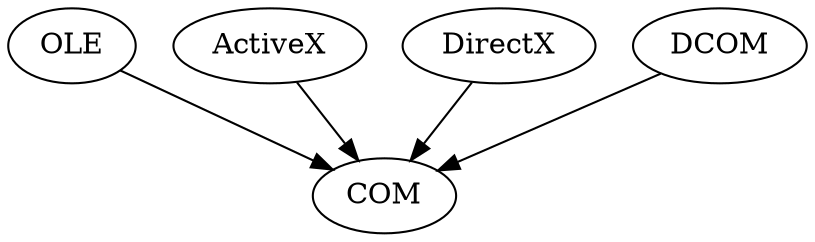
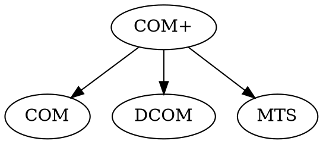

## Overview
所谓COM即“组件对象模型”，是一种说明如何建立可动态互变组件的规范，此规范提供了为保证能够互操作，客户和组件应遵循的一些二进制和网络标准。通过这种标准将可以在任意两个组件之间进行通信而不用考虑其所处的操作环境是否相同、使用的开发语言是否一致以及是否运行于同一台计算机。开发COM的目的是为了使应用程序更易于定制、更为灵活，简而言之，就是一种打包技术。

## 其它组件技术
EJB CORBA XPCOM

## COM 相关技术

## C++ COM 接口规范
每个虚函数表的前三项是：QueryInterface, AddRef, Release 

## References
[COM接口的背后 - 不能使用虚继承的必要性 - 虚拟继承所形成的内存结构，不符合COM接口的要求](https://blog.csdn.net/Mr_SGQ/article/details/9673155)

[com的主要接口介绍](https://blog.csdn.net/lp310018931/article/details/48577043)

[COM组件技术在Linux C++下的使用例子](https://blog.csdn.net/u011641755/article/details/52349077)

[OLE COM DCOM COM+技术与OPC技术](http://blog.sina.com.cn/s/blog_4aee288a0102va81.html)